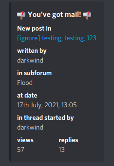

Forum Message Tracking
######################

**forum commands**

Those are command to track new forum messages!
Example of output below.

check `the list <https://discoverygc.com/forums/search.php?action=getdaily>`_
of precised forum thread names before using the commands

forum add
***********

possible usages:

.. code-block::

    .forum add WTB

if you want all new forum messages shown, use

.. code-block::

    .forum add ""     

you can add multiple forum tags in one command

.. code-block::

    .forum add "[GSB]", "LN-", "LSF"

it will be rendering all new forum messages in threads having one of those tags

additional commands

forum remove
**************

for deleting of one forum tags

.. code-block::

    .forum remove "LN-"

forum clear
*************

to clear the whole list of forum tags

.. code-block::

    .forum clear
