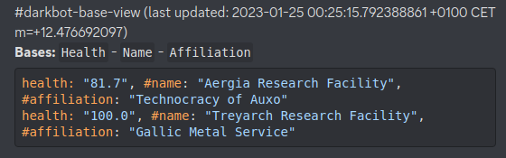

# Name

Darkbot3

**[Invite Link](https://discord.com/api/oauth2/authorize?client_id=838460303581904949&permissions=8&scope=bot)**

# Description

- This project is a discord bot **Darkbot3** for open source game community [Freelancer Discovery](https://discoverygc.com/)
- It underwent a major refactorization and now reimplemented in golang with clean architecture for code scalability to add new features
- and for general stability, because all errors are now handled way better with Golang approach that handles most of them at compile time.
- project saves ready for deployment docker images [at docker hub](https://hub.docker.com/repository/docker/darkwind8/darkbot/general), see [settings here](https://github.com/darklab8/darklab_darkbot/blob/master/infra/kubernetes/charts/darkbot/templates/main.yml)

User connects darkbot to some discord channel, and sets settings which space bases, player tags or space systems to track.
Darkbot repeatedly updates information to discord channel

# Architecture

The project has 5 package parts parts:

- scrappy scraps third party REST APIs and web forum for data. Stores in in storage (memory) to other modules
- configurator is interacting with SQL database to store user settings
- listener is Discord API connected application, that accepts user commands from channel and sends to consoler, and gives from it answer
- consoler is a CLI interface to accept input from listener and render its CLI answer back
- viewer is application that in a loop gets user settings and connected channels, and rerenders to them view based on available data in scrappy and configurator settings

# Project plans:

[See wiki](https://darklab8.github.io/darklab_darkbot/)

# Tech stack

- golang
- discordgo
- cobra-cli
- gorm (sqlite3)
- docker
- terraform (hetzner / helm)
- microk8s (helm)

# Dev commands

install taskfile.dev for dev commands

go run . --help

task test # to test
task --list-all # to list other commands 

# Goals to follow:

- having it clean architectured as possible
- testing coverage should be no less than 80%, ideally 90%+
- following different OOP principles, like having minimum exposed interfaces to rest of a code
- following semantic versioning with the help of [darklab_autogit](https://github.com/darklab8/darklab_autogit)

